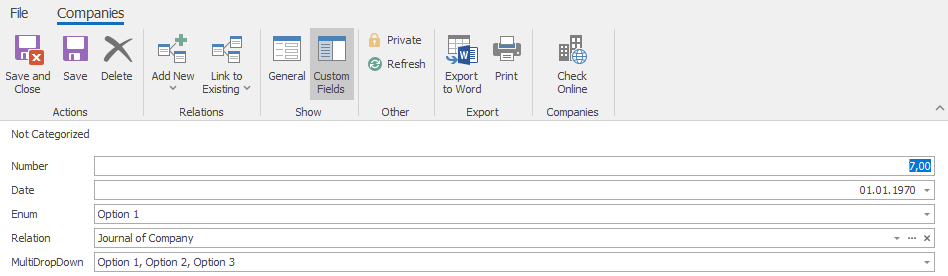

# Manipulating with additional fields
This example should provide some insight into manipulation with additional fields, namely fields of numeric, date, enum, relation and multi dropdown type.

## Find what additional fields are available
First, we want to look for what additional fields we can work with. This we will do by using method `$connector->getAdditionalFields()`. 
```php
// Search for all additiona aields
$additionalFields = $connector->getAdditionalFields();
```

### Make manipulation easier
We can make manipulation with these additional fields easier by selecting only information we need. In this case, we want to iterate through the fields that are belonging to company ("ObjectType[FolderName](../../FolderNames.md)" is "Companies") and create array "additionalFieldsNames", where name of the field is key and the fields number is its value (we also add the af_ prefix, which we use in eWay-CRM).
```php
// Create array of names for easier manipulation
foreach ($additionalFields->Data as $field)
{
    // Take to acount only fields which belong to company
    if($field->ObjectTypeFolderName == 'Companies')
    {
        $additionalFieldsNames[$field->FileAs] = 'AF_'.$field->FieldId;
    }
}
```

## Searching for values of the enum additional field
We now want to find values which we can give our additional field of enum type.  We will prepare array with "EnumName" (we need to change the prefix from af_ to AF_ here) and use it as criteria of search for "EnumType" by method `$connector->searchEnumTypes()`. Enum type of the field will provide us GUID which we can use to pair the values themselves. With the GUID in array, we use it as parameter of method `$connector->searchEnumValues()`. In the end we iterate through the values and put them in array "enumValuesOptions" with name as key and GUID as value to ease manipulation.
```php
// Here we prepare criteria of enum type search
$criteria = array(
                   'EnumName' => $additionalFieldsNames['Enum']
                );
    
// Search Enum type of our enum additional field
$enumType = $connector->searchEnumTypes($criteria);

// Here we prepare criteria of enum values search
$criteria = array(
                   'EnumType' => $enumType->Data[0]->ItemGUID
                );

// Search enum type of our enum additional field
$enumValues = $connector->searchEnumValues($criteria);

// Create array of enum values
foreach ($enumValues->Data as $value)
{
    $enumValuesOptions[$value->FileAs] = $value->ItemGUID;
}
```

## Searching for values of the multi dropdown additional field
We can do that the same way as we did the enum values.  Search ''EnumType" by AF_ number with `$connector->searchEnumTypes()`, then search values themselves with `$connector->searchEnumValues()`. There is one difference. We add only GUIDs of values into an array to prepare the final value (GUIDs of values in this array determines which values in the multi dropdown are selected).
```php
// Here we prepare criteria of enum type search
$criteria = array(
                   'EnumName' => $additionalFieldsNames['MultiDropDown']
                );

// Search enum type of our MultiDropDown additional field
$enumType = $connector->searchEnumTypes($criteria);

// Here we prepare criteria of MultiDropDown values search
$criteria = array(
                   'EnumType' => $enumType->Data[0]->ItemGUID
                );

// Search Enum type of our MultiDropDown additional field
$enumValues = $connector->searchEnumValues($criteria);


// Prepare container for values
$multiDropDownValues = array();

// Create value for the MultiDropDown
foreach($enumValues->Data as $value)
{
    array_push($multiDropDownValues, $value->ItemGUID); 
}
```

## Relation additional field value
Relation additional field require foreign key as value (GUID) so we create new journal to use its GUID as the value.
```php
// This is new journal we want to create
$newJournal = array(
                    'FileAs' => 'Journal of Company',
                    'Note' => 'this is journal of Company.'
                    );

// Try to save new journal
$journal = $connector->saveJournal($newJournal);
```

## Create company with additional fields
Now we prepare array with all the additional fields. Number and date takes values as usual. Enum field will be filled with option we choose from our prepared array. At last we insert our prepared value to multi dropdown field (array of GUIDs of selected options). Now we have everything prepared, we create array with specifications of company. Here we can use our additional fields array as value for "AditionalFields". Then we save the company by  `$connector->saveCompany()`.
```php
// Fill the additional fields
$additionalFieldsValues = array(
                                $additionalFieldsNames['Number'] => '7',
                                $additionalFieldsNames['Date'] => '1970-01-01',
                                $additionalFieldsNames['Enum'] => $enumValuesOptions['Option 2'],
                                $additionalFieldsNames['MultiDropDown'] => $multiDropDownValues,
                                $additionalFieldsNames['Relation'] => $journal->Guid
                            );

// This is new company, that we want to create
$newCompany = array(
                    'FileAs' => 'Company a.s.', 
                    'CompanyName' => 'Company a.s.',
                    'Purchaser' => '1',
                    'Phone' => '121 252 733',
                    'Email' => 'Email@company.com',
                    'AdditionalFields' => $additionalFieldsValues
                    );

// Try to save new company
$company = $connector->saveCompany($newCompany);
```

## Output

### Simple HTML table
After successfully running this example, you should have company with filled additional fields visible in eWay-CRM. 


## Sample code
To see the whole sample code click [here](sample_code.php).

## Folder name
To ease understanding folder names, look [here](../../FolderNames.md).