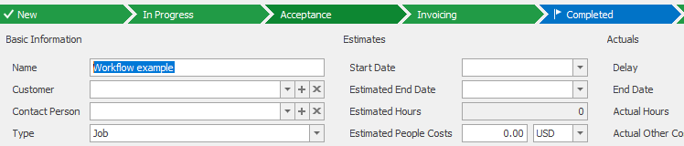

# Change status on Project
This example will show you how to change status on Project

## Create Project and store GUID
We will create "testing" Project as subject of this example by  ```$connector->saveProject()``` with array of specifications as parameter. In a real life scenario, the Project would probably already exist and we would search for it with ```$connector->SearchProjects()```. Method that is saving the Project will also return us an object with GUID of the Project.
```php

// This is new project, that we want to create
$project = array(
                 'FileAs' => 'Workflow example',
                 'StateEn' => '0D6D6D0B-2849-11E2-8ABD-00155D002216',
                 'TypeEn' => '0FB1978A-35C9-4A44-9C1A-6923A72A188A'
                 );

// Save the Cart
$project_guid = $connector->saveProject($project)->Guid;

```
### Output
As an output we should see our new Project with state "new" in Outlook.



## Changing the status
Our testing Project was created with "new" state, similar to if it was created in Outlook. Important thing about states is that the state may only be changed back and forth accordingly to predefined workflows. In our case from "new" to "completed" and backwards. We will need item version of the project, which we will get by ```$connector->searchProjects()``` with project GUID as parameter and extract item version from the returned object. Now we can call ```$connector->saveProject()``` with array of specifications to edit the Project. For purpose of editing, there have to be GUID of the changed Project. Alongside we supply type of the project (GUID of the type), new state of the project, "completed" in our case (GUID of the state) and item version.
```php

// Load version of project for state changing
$project_version = $connector->searchProjects(array('ItemGUID' => $project_guid))->Data[0]->ItemVersion + 1;

// Changed fields of the projects
$project_edit = array(
                      'ItemGUID' => $project_guid,
                      'StateEn' => '0D6D6D11-2849-11E2-8ABD-00155D002216',
                      'TypeEn' => '0FB1978A-35C9-4A44-9C1A-6923A72A188A',
                      'ItemVersion' => $project_version
                      );

// Edit the state of the project
$connector->saveProject($project_edit);

```
### Output
As an output we should see our Project now having "completed" state in Outlook.


## Sample code
To see the whole sample code click [here](sample_code.php)