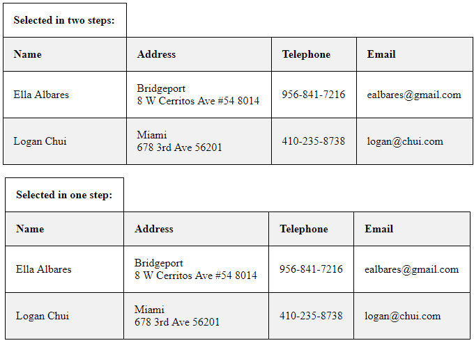

# Find Contacts changed since last time
This example will show you how to find contacts which were created, changed or deleted since last time. It is expected that you have a persistent storage to store CurrentId (revision number) at your disposal. This number is symbolising a point in time (a timestamp of the current revision).

```php

class Storage
{
	// Container for the revision number
	public $current_revision = 3000;

	// Method for loading current revision number
	function storeCurrentRevision($revision_number)
	{
		// TODO: Here should be code for storing the current revision number from persistent storage.
		$this->current_revision = $revision_number;
	}
	
	// Method for loading current revision number
	function loadCurrentRevision()
	{
		// TODO: Here should be code for loading the current revision number from persistent storage.
		return $this->current_revision;
	}
}

// Initialize storage
$storage = new Storage();

```
*Note for experts: The API registers changes on foreign keys on the item as item change as well, even though they are emulated.* 

The example shows two ways of listing changed contacts. One is realised in two steps, first get GUIDs of changed items, then find the item changes. The other is done in just one function. 

## 1) Get changed identifiers
This is in case you want to see just identifiers of changed items. First we acquire GUIDs of changed contacts with use of function ```$connector->getItemChangeIdentifiers()``` . First parameter is name of the item [folder](/../../blob/master/FolderNames.md), second is current revision number and the third is target revision which is supplied by function ```$connector->getLastItemChangeId()``` . Current revision number is essentially time of your last check of item changes and target revision number is time to which you want your item changes update to.


```php

// Revisions interval
$latest_revision = $connector->getLastItemChangeId()->Datum;
$current_revision = $storage->loadCurrentRevision();;

// Get contact GUIDs
$item_data = $connector->getItemChangeIdentifiers('Contacts', $current_revision, $latest_revision)->Data;

// Go through the contact GUIDs
foreach ($item_data as $data)
{
    // Extract the GUIDs
    array_push($contact_guids, $data->ItemGUID);
}

```

After that we can use our extracted GUIDs to find according contacts.

```php

// Get contacts based on guids
$contacts_from_guids = $connector->getContactsByItemGuids($contact_guids)->Data;

```

## Output

### Simple HTML table
To ease orientation in output of our search we can create simple HTML table. The output should look something like this.


## 2) Get changed items details right away
This option will get the item details one step. That can be done by function ```$connector->getChangedItems()``` which is very similar to function  ```$connector->getItemChangeIdentifiers()``` but can be supplied with [folder names](/../../blob/master/FolderNames.md) and will return you detail of changed items (Item GUIDs in case of deletion).

```php

// Get contacts
$contacts = $connector->getChangedItems(array('Contacts'), $current_revision, $latest_revision)->Data[0]->ChangedItems;
```

## Output

### Simple HTML table
To ease orientation in output of our search we can create simple HTML table. We are doing both options in this one example code, so there should be two tables now. The output should look something like this.


## Store current revision
Now that we are up to date, we should update revision number in our storage.
```php

// Store revision number
$storage->storeCurrentRevision($latest_revision);
```

## Sample code
To see the whole sample code click [here](sample_code.php)