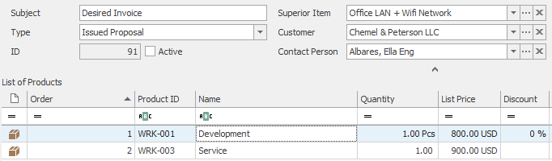

# Create new Invoice with relations
This example will show you how to create new bookkeeping record (cart) with relation to Customer, Company and Project. It will also have Goods, one already existing and one freshly created.

We need to specify array with parameters of our cart, namely: FileAs and GUIDs of Company, Contact and Project. Then we add array which will include other arrays of related Goods. These should have Goods GUID for link to existing Good, or FileAs, Name and Code to create new Product on Bookkeeping Record, but without link to previously existing Good.

```php

//This is new cart, that we want to create
$newCart = array(
	 'FileAs' => 'Desired Invoice',
	 'Companies_CustomerGuid' => 'bc0c3aef-64c9-4db5-a739-370937268203',
	 'Contacts_ContactPersonGuid' => '0db3650f-bb87-4acc-96d6-9e6993cc6e61',
	 'GoodsInCart' => array(
							array(
								  'Goods_GoodsInfoGuid' => '9c09e24a-3901-448f-928e-d2041d327cc7'
								 ),
							array(
								  'FileAs' => 'Service',
								  'Name' => 'Service',
								  'Code' => 'WRK-003',
								  'PriceTotal' => '900'
								  ),
							),
	 'Projects_CartGuid' => '5dac8817-ac48-4469-bae3-41778042a911'
	 );
}

```

Now we use function ```$connector->saveCart()``` with our array as parameter to save the Cart.

```php

//Save the Cart
$connector->saveCart($newCart);
```

## Output

Once created, the Cart should look something like this:




## Sample code
To see the whole sample code click [here](sample_code.php)