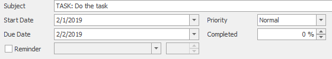
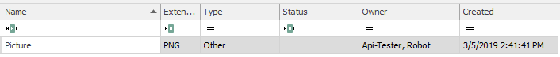

# Create Task with Document
This example will show you how to create new Document, new Task and link them with basic relation.

## Create Task 
We will create a Task by using function ```$connector->saveTask()``` supplied with array of parameters. In the parameters we have ```$userGuid``` which we got from function ```$connector->searchUsers()``` with FileAs of the user as parameter. 
 ```php

// Get user GUID
$userGuid = $connector->searchUsers(array('FileAs' => 'Api-Tester, Robot'))->Data[0]->ItemGUID;

// This will be our Task
$task = array(
            'StartDate' => '2019-02-01 20:00:00Z',
            'DueDate' => '2019-02-02 04:00:00Z',
            'Subject' => 'TASK: Do the task',
            'FileAs' => 'TASK: Do the task',
            'Users_TaskDelegatorGuid' => $userGuid,
            'Users_TaskSolverGuid' => $userGuid
            );

// Save the task
$taskResult = $connector->saveTask($task);

 ```
### Output
As an output, you should see the Task appear in outlook application.


## Create Document
Now we create our Document. First we upload binary of the file by ```$connector->saveBinaryAttachment()``` with path to the file as first parameter and empty variable for GUID of our document (we can supply it with our own GUID of choice, but remember to put it in parameters of the document too) and then, similarly to saving task, we have an array of parameters and supply it to the ```$connector->saveDocument()``` function.
 ```php

//Save the Document
$documentResult = $connector->SaveDocument($document);
 
// This will be our Document
$document = array(
                    'ItemGUID' => $GUID,
					'FileAs' => 'Picture',
					'DocName' => 'Picture',
					'DocSize' => filesize('Picture.PNG'),
					'Extension' => 'PNG'
                  );

// Save the Document
$documentResult = $connector->saveDocument($document);

 ```
### Output
As an output, you should see the Document appear in outlook application.


## Link items together
All there is left now, is to link both items together. Again we prepare our array with parameters with GUIDS of both items, their folder names (Tasks and Documents) and type of the relation (GENERAL in our case). Than we supply the array as a parameter of function  ```$connector->saveRelation()``` and we are ready to go.
 ```php

// Specifications of our relation
    $relation = array(
                    'ItemGUID1'     => $taskResult->Guid,
                    'ItemGUID2'     => $documentResult->Guid,
                    'FolderName1'   => 'Tasks',
                    'FolderName2'   => 'Documents',
                    'RelationType'  => 'GENERAL'
                    );

    // Save the relation
    $output = $connector->saveRelation($relation);

 ```
 ### Output
As an output, you should see the Document appear in the Task form as a linked item.


## Sample code
To see the whole sample code click [here](sample_code.php)

## Folder name
To ease understanding folder names, look [here](/../../blob/master/FolderNames.md).