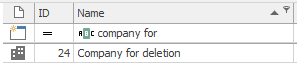

# Delete company
This example will show you how to delete company. Below you can see that we have company named "Company for deletion".



Deletion is done by using function ```$connector->deleteCompany()``` with GUID of company we want to delete.

```php

// GUID of company
$company = '7dfde804-2ed4-11e9-be3d-bc5ff40119b6';

// Delete the company
$output = $connector->deleteCompany($company);

```

We can now check that if we look for the company now, eWay-CRM will not find any results. The company was successfully deleted.


## Sample code
To see the whole sample code click [here](sample_code.php)