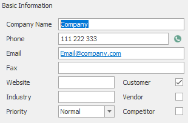
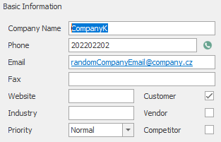

# Editing existing Company
This sample shows how to edit existing company. 



We need GUID of company we want to edit. Editing itself is done by function `$connector->saveCompany()` with array containing GUID of company and parameters we want to change.
```php

// Edit the company
$company = array(
                  'ItemGUID' => 'ebdd18f3-92e9-412d-afec-e1aaf6139b09',
                  'FileAs' => 'CompanyK', 
                  'CompanyName' => 'CompanyK',
                  'Purchaser' => '1',
                  'Phone' => '202202202',
                  'Email' => 'randomCompanyEmail@company.cz'
                );

$connector->saveCompany($company);

```

This is what it should look like after the edit:



## Sample code
To see the whole sample code click [here](sample_code.php)