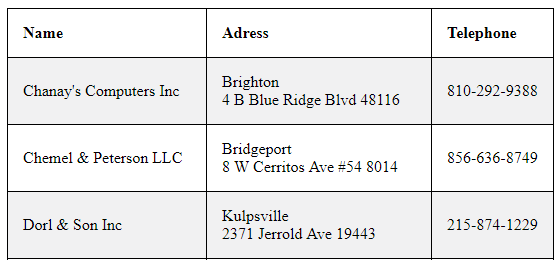

# List all Companies
This example displays how to list all companies. All there is to it is using function ```$connector->GetCompanies()``` .

```php

//Get companies
$result = $connector->GetCompanies();

```

## Output

### Simple HTML table
To ease orientation in output of our search we can create simple HTML table. The output should look something like this.


### Raw output
Alternatively, you can add ```var_dump($output)``` at the end of the example code to see raw output.

## Sample code
To see the whole sample code click [here](sample_code.php)