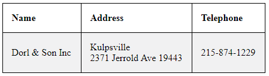

# Searching for Company

This example should show you how to search for company based on one or more parameters.

All you need to is to make yourself an array with parameters by which you want to search company and use it as an argument of function ```$connector->SearchCompanies()``` .

```php

//Search criteria
$company = array(
                'FileAs' => 'Dorl & Son Inc'    
                );

// Create connector
$connector = new eWayConnector('https://trial.eway-crm.com/31994/WcfService/Service.svc', 'api', 'ApiTrial@eWay-CRM');

//Search for the company
$output = $connector->SearchCompanies($company);

```

## Output

### Simple HTML table
To ease orientation in output of our search we can create simple HTML table. The output should look something like this.


### Raw output
Alternatively, you can add ```var_dump($output)``` at the end of the example code to see raw output.

## Sample code
To see the whole sample code click [here](sample_code.php)